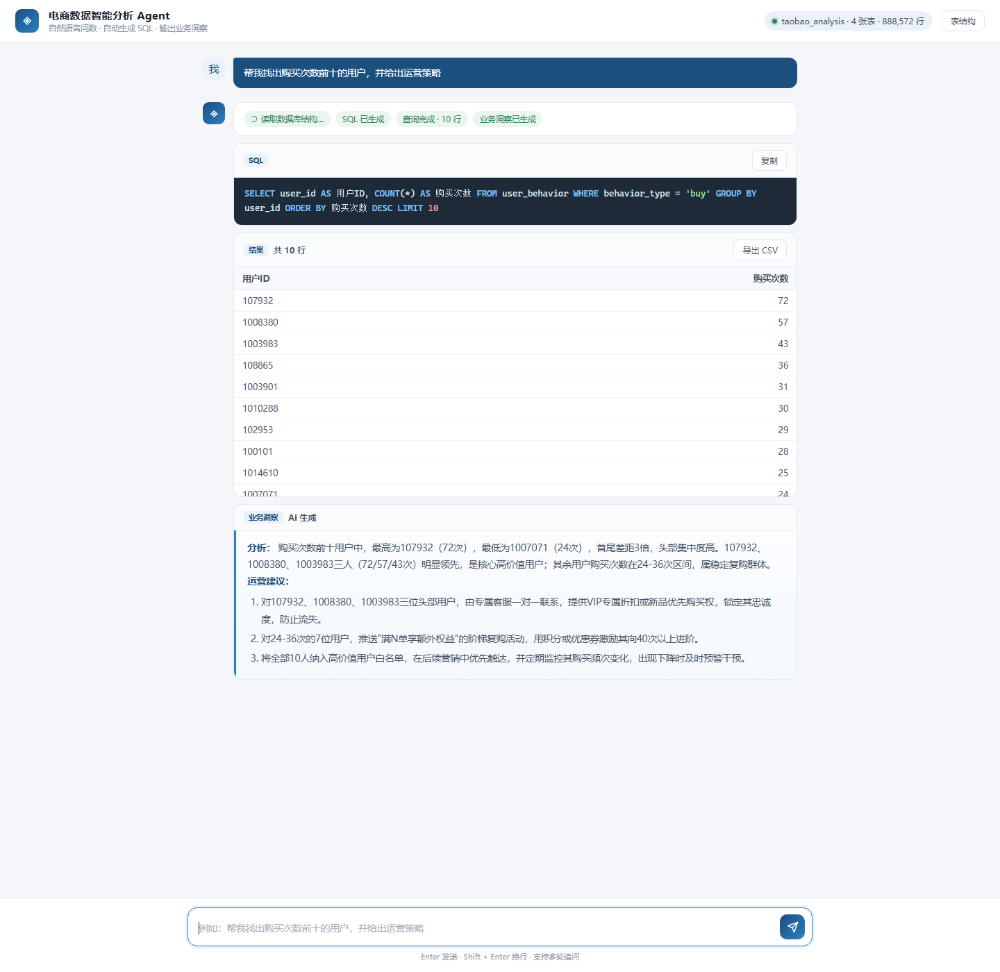

# 电商数据智能分析 Agent · Web 版

### 📌 项目简介
传统取数流程：业务提需求 → 排期 → 开发写 SQL → 等结果，周期长、沟通成本高。

本项目实现了一个 NL2SQL 智能问数 Agent，业务人员只需在网页里输入中文问题，系统自动完成：

读取数据库表结构（自动生成提示词）

调用大模型生成 SQL

执行 SQL 并返回结果表格

基于结果生成业务洞察与运营建议
---

## 效果

提问 → 自动生成 SQL → 执行查询 → 结果表格 + 业务洞察，全程流式展示：

```
你：帮我找出购买次数前十的用户，并给出运营策略

Agent：
  ▸ 读取数据库结构…          ✓
  ▸ 生成 SQL…                ✓
  SELECT user_id AS 用户ID, COUNT(*) AS 购买次数
  FROM user_behavior WHERE behavior_type = 'buy'
  GROUP BY user_id ORDER BY 购买次数 DESC LIMIT 10
  ▸ 查询完成 · 10 行         ✓
  ┌─────────┬──────────┐
  │ 用户ID  │ 购买次数 │
  ├─────────┼──────────┤
  │ 107932  │       72 │
  │ 1008380 │       57 │
  └─────────┴──────────┘
  ▸ 业务洞察已生成           ✓

  **分析：** 头部用户购买频次远高于普通用户，是平台高价值核心客群…
  **运营建议：**
  1. 对购买 40 次以上的三位用户建立 VIP 专属档案…
  2. 对 24–36 次区间的用户推送会员等级升级提醒…
```

---

## 相比命令行版多了什么

| 能力 | 说明 |
|---|---|
| **浏览器交互** | 对话式界面，支持多轮追问（"那加购和购买的比例是多少"） |
| **表结构自动读取** | 从 `information_schema` 自动生成提示词，加了新表不用再手改 `TABLE_SCHEMA`；顺带把 `users` / `products` / `categories` 也纳入了 |
| **SQL 只读护栏** | 只放行 `SELECT` / `WITH`，拦截 `DROP` / `DELETE` / `UPDATE` / `INSERT` / 多语句注入；没写 `LIMIT` 会自动补上 |
| **SQL 自愈重试** | 执行报错时把 MySQL 的错误信息回传给模型，让它自己改，最多重试 2 次 |
| **流式输出** | SSE 推送，SQL、结果表、洞察逐步出现，不用干等 |
| **结果可导出** | 表格右上角一键导出 CSV（带 BOM，Excel 打开不乱码） |
| **废弃列屏蔽** | `user_behavior.behavior_count` 全为 0，已从提示词里剔除，避免模型误用得出错误结论 |
| **密钥外置** | API Key 和数据库密码走 `.env`，不再硬编码在脚本里 |

---

### 🛠️ 技术栈
后端：FastAPI + SSE + Uvicorn

数据库：MySQL + PyMySQL

大模型：DeepSeek API（兼容 OpenAI SDK）

前端：原生 JavaScript 单文件（无构建步骤）

配置：python-dotenv

---
## 快速开始

```bash
# 1. 安装依赖
pip install -r requirements.txt

# 2. 配置密钥（复制模板后填入自己的值）
copy .env.example .env      # Windows
# cp .env.example .env      # macOS / Linux

# 3. 启动
python app.py
```

然后打开 **http://127.0.0.1:8000**

> 也可以用 `python -m uvicorn app:app --host 127.0.0.1 --port 8000 --reload` 启动，带热重载。

### `.env` 说明

```ini
DEEPSEEK_API_KEY=sk-xxx          # DeepSeek 密钥
DB_HOST=localhost
DB_USER=root
DB_PASSWORD=xxx
DB_NAME=taobao_analysis

HIDDEN_COLUMNS=user_behavior.behavior_count   # 不暴露给模型的列，逗号分隔
```

**`.env` 已在 `.gitignore` 中，不会被提交。** 

---

## 目录结构

```
实习项目2/
├── app.py              # FastAPI 后端：三步链路 + SQL 护栏 + SSE
├── static/
│   └── index.html      # 单文件前端（原生 JS，无构建步骤）
├── requirements.txt
├── .env.example
└── README.md
```

## 接口

| 方法 | 路径 | 说明 |
|---|---|---|
| GET | `/` | 前端页面 |
| GET | `/api/health` | 探活：数据库连通性、表数量、总行数、Key 是否配置 |
| GET | `/api/schema` | 返回 Agent 实际看到的表结构文本 |
| POST | `/api/ask` | 提问，SSE 流式返回 `stage` / `sql` / `result` / `insight` / `error` / `done` |

## 网页效果展示图

----


